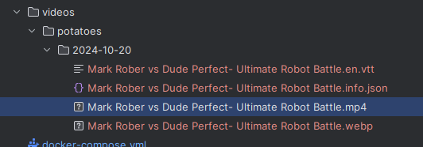

# autotubedownloader

## what is it?

autotubedownloader is a youtube downloader that automatically downloads videos from youtube.
It takes a list of channels and downloads the most recent videos from each channel.
It skips any videos that have already been downloaded or ignored.
It waits up to a week for the videos to receive a sponsorblock segment.

The downloads are put into the videos directory.
more specifically: each category is a folder in the videos directory, each day is a folder in the category directory, each video is a file in the day directory.
here's a picture as an example:  

## how do I use it?

To use autotubedownloader there are two options.

### Option 1: docker

To use autotubedownloader with docker I recommend setting up a docker-compose file.
Here is a very simple docker-compose file:
```yaml
version: "3.3"
services:
    myapp:
        image: simoneklundh/autotubedownloader
        container_name: autotubeDownloader
        volumes:
            - ./config:/config  # Bind mount your local directory
            - ./videos:/videos
            - ./categories:/categories
```
the videos directory is where the downloaded videos will be stored.
the categories directory is where you can add new channels in an easy way.
the config directory will contain a "list" of what channels you follow, a "list" of what videos broke, what videos you ignored and a "list" of what videos you want to ignore.

more about this will be in the next chapter.

### Option 2: python

you can also run autotubedownloader with python.

I don't recommend it. the starting point is the main.py file in the src directory.

## what do the directories mean?

### videos

The videos directory is where the downloaded videos will be stored.

### categories

The categories directory is where you can add new channels in an easy way.
This is done by creating a text file in the categories directory and then adding links to youtube videos into it, one per line.
the name of the text file becomes the name of the category.


### config

The config directory is where the config files are stored.
The config files are json files.
The config files are used to store the channels you follow, the videos you want to ignore, the videos you want to skip and the videos that have broken.

the following config files are created automatically when you run autotubedownloader:

- channels.json
- ignored.json
- broken.json
- skipped.json

these can be manually edited, but I'd recommend against it.

the following config files are recommended to be manually created:

- skip.json

the skip.json file contains a list of keywords that you want to skip.

here's an example of a skip.json file:

```json
{
  "skip_in_all_categories": ["potatoes"],
  "skip_categories": {
    "category1": {
      "skip_in_this_category": ["keyword1", "keyword2"],
      "author1": ["keyword1", "keyword2"],
      "author2": ["keyword3", "keyword4"]
    }
  }
}
``` 
this will skip all videos with the keywords "potatoes" in any category.
as well as any videos with the keywords "keyword1" and "keyword2" in the "category1" category and any videos with the keywords "keyword3" and "keyword4" from author2.
